- [Repository Info](#orgce80fcb)
- [Images](#org1e3806e)
- [Schematic](#org159c394)
- [PCB](#org68cfc3f)
- [Bill of Materials](#orgc4155db)
- [Development](#orgb854619)

    <!-- This file is generated automatically from metadata -->
    <!-- File edits may be overwritten! -->


<a id="orgce80fcb"></a>

# Repository Info

-   Project Name: thruster-pcb
-   Synopsis:
-   Documentation Version: 1.0.0
-   Pcb Version: 1.0
-   Enclosure Version: 1.0
-   Supplemental BOM Version: 1.0
-   Release Date: 2025-02-19
-   Creation Date: 2025-01-04
-   Kicad Version: 7.0.11
-   License: GPL-3.0h
-   URL: <https://github.com/mechatronicmagic/thruster-pcb>
-   Author: Peter Polidoro
-   Email: peter@polidoro.io
-   Copyright: 2025 Mechatronic Magic
-   References:
    -   [Servo Control](https://en.wikipedia.org/wiki/Servo_control)
    -   [SB2264MG Servo](https://www.savoxusa.com/products/savsb2264mg-low-profile-hv-brushless-servo)
    -   [PCA9685](https://www.nxp.com/products/power-management/lighting-driver-and-controller-ics/led-drivers/16-channel-12-bit-pwm-fm-plus-ic-bus-led-driver:PCA9685)
    -   [nRF52840 Express](https://www.adafruit.com/product/4062)


<a id="org1e3806e"></a>

# Images

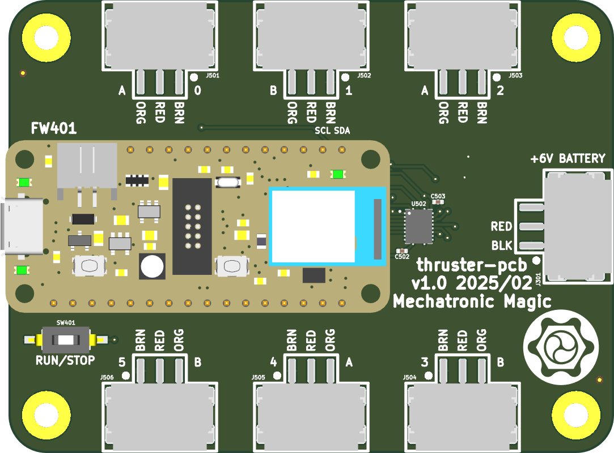

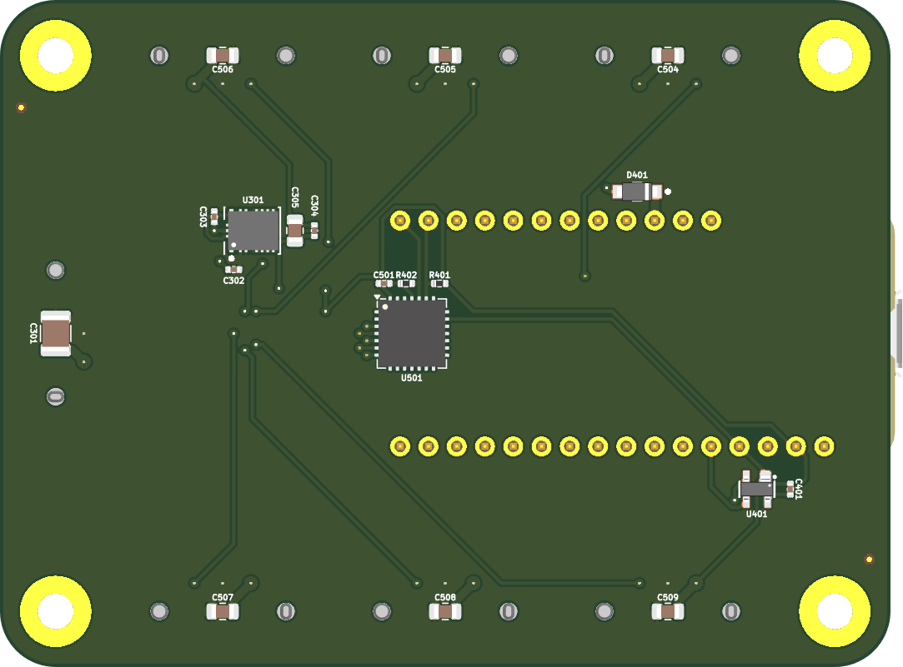

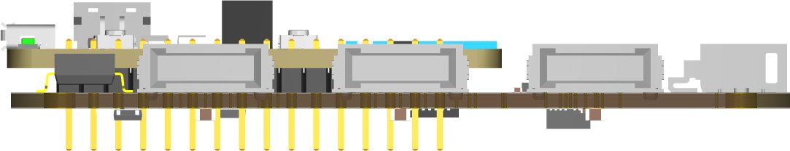

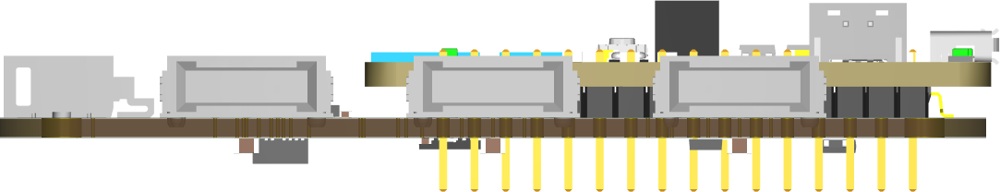

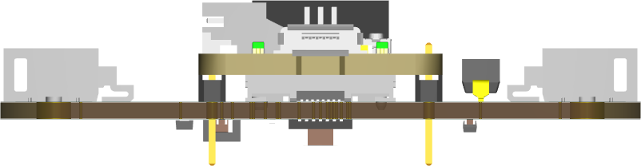

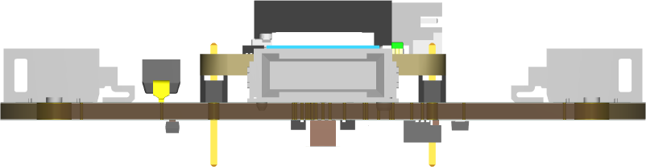


<a id="org159c394"></a>

# Schematic

[./documentation/schematic/thruster-pcb.pdf](./documentation/schematic/thruster-pcb.pdf)

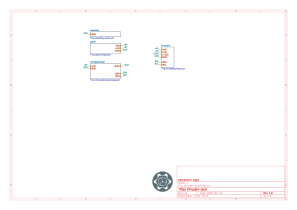

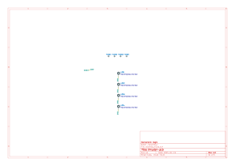

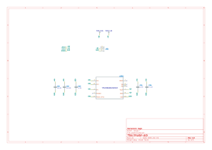

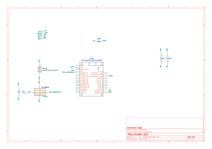

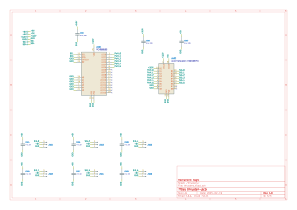


<a id="org68cfc3f"></a>

# PCB


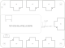

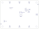


<a id="orgc4155db"></a>

# Bill of Materials


## Board

|    |
|--- |
|  |


## Supplemental

| Item | Synopsis                          | Manufacturer Part Number | Manufacturer | Quantity | Cost  | Total |
|---- |--------------------------------- |------------------------ |------------ |-------- |----- |----- |
| 1    | Adafruit Feather nRF52840 Express | 4062                     | adafruit     | 1        | 24.95 | 24.95 |
|      | Supplemental BOM Version: 1.0     |                          |              |          | Total | 24.95 |


<a id="orgb854619"></a>

# Development


## Install Guix

[Install Guix](https://guix.gnu.org/manual/en/html_node/Binary-Installation.html)


## Generate Output from KiCad


### Remove previous versions

```sh
rm -rf ./documentation/3dmodels/* && rm -rf ./documentation/bom/* && rm -rf ./documentation/fabrication/* && rm -rf ./documentation/pcb/* && rm -rf ./documentation/schematic/*pcb
```


### Images

1.  3D Viewer

    Output directory: ../documentation/pcb
    
    -   pcb.png
    -   top.png
    -   bottom.png
    -   front.png
    -   back.png
    -   left.png
    -   right.png

2.  Trim

        make trimmed-images

3.  Schematic PDF

    File -> Plot
    
    Output directory: ../documentation/schematic
    
    Plot All Pages
    
    -   Output format PDF
    -   Page Size = Schematic size
    -   Plot drawing sheet
    -   Output mode = Color
    -   Color theme = KiCad Default
    -   Default line width = 0.006 in

4.  Schematic SVG

    File -> Plot
    
    Output directory: ../documentation/schematic
    
    Plot All Pages
    
    -   Output format SVG
    -   Page Size = Schematic size
    -   Plot drawing sheet
    -   Output mode = Color
    -   Color theme = Solarized Light
    -   Default line width = 0.012 in

5.  PCB SVG

    Add Edge.Cuts, holes, and dimensions to User.Drawings
    
    File -> Plot
    
    Output directory: ../documentation/pcb
    
    -   Plot format SVG
    -   Include Layers
        -   User.Drawings
        -   F.Silkscreen
        -   B.Silkscreen
        -   F.Fab
        -   B.Fab
    -   Plot on All Layers
        -   Edge.Cuts
    -   Plot footprint values
    -   Plot reference designators
    -   SVG Options
        -   Precision = 4
        -   Output mode = color
    
        make cropped-svg


### Fabrication Files

1.  Gerbers

    File -> Fabrication Outputs -> Gerbers (.gbr)
    
    Output directory: ../documentation/fabrication/gerbers
    
    Include Layers:
    
    -   F.Cu
    -   F.Paste
    -   F.Silks
    -   F.Mask
    -   F.Fab
    -   B.Cu
    -   B.Paste
    -   B.Silks
    -   B.Mask
    -   B.Fab
    -   Edge.Cuts - (contain the board outline/cutouts.)
    -   In1.Cu, In2.Cu … - (needed for 4/6 layer designs.)
    
    Options:
    
    -   Select Plot reference designators, otherwise designators will not appear on silkscreen layers.
    -   Select Check zone fills before plotting
    -   Select Use Protel filename extensions, this is recommended as JLCPCB prefers Protel filename extensions.
    -   Select Subtract soldermask from silkscreen, this ensures no silkscreen on pads.
    -   Coordinate format 4.6 unit mm

2.  Drill and Map Files

    Output directory: ../documentation/fabrication/gerbers
    
    Options:
    
    -   Excellon drill file format
    -   Check Use alternate drill mode for "Oval Holes Drill Mode".
    -   Check Absolute for "Drill Origin".
    -   Check Millimeters for "Drill Units".
    -   Check Decimal format for "Zeros Format".
    -   Gerber X2 map file format
    
    Zip gerber files
    
        zip ./documentation/fabrication/gerbers.zip ./documentation/fabrication/gerbers/*

3.  BOM

    Generate BOM from schematic editor using blank command line to create bom xml file.

4.  POS

    File -> Fabrication Outputs -> Component Placement (.pos)
    
    Output directory: ../documentation/fabrication/
    
    Settings:
    
    -   Format = CSV
    -   Units = Millimeters
    -   Files = Single file for board
    -   Do not use drill/place file origin
    
    Modify pos files:
    
    -   Ref -> Designator
    -   PosX -> Mid X
    -   PosY -> Mid Y
    -   Rot -> Rotation
    -   Side -> Layer

5.  Step

    File -> Export -> Step
    
    Output directory: ../documentation/3dmodels/pcb.step
    
    -   Drill/place file origin
    -   Overwrite old file
    -   Standard Board outline chaining tolerance


## Edit metadata.org

    make metadata-edits


## Tangle metadata.org

    make metadata


## Edit project

    make kicad-edits
    exit
